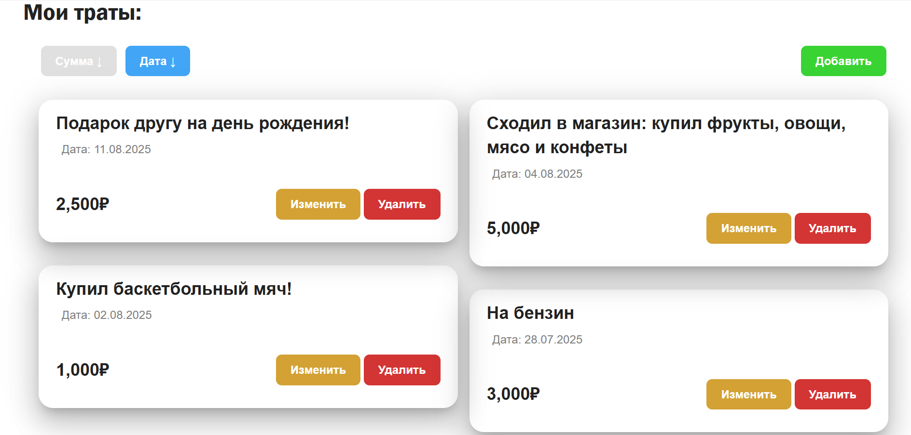
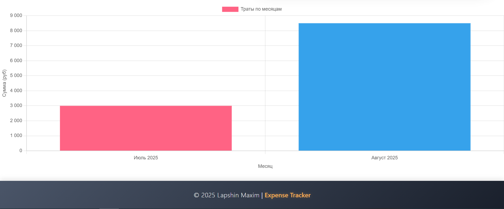
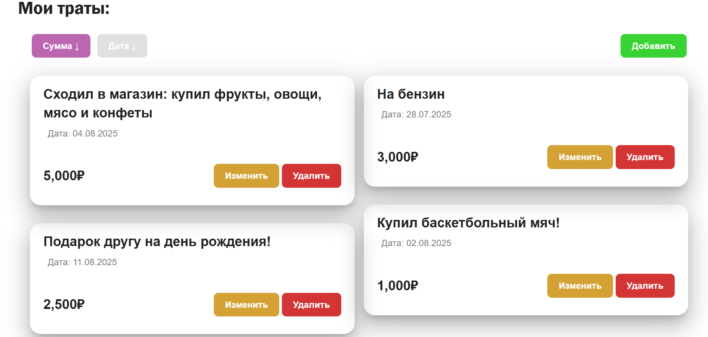

# ExpenseTrackerApp - трекер расходов

Простое веб-приложение для учета личных расходов с фронтендом на AngularJS и бэкендом на ASP.NET Core Web API.

## ✨ Особенности

- 📝 Добавление, редактирование и удаление записей о расходах
- 📊 Визуализация трат с помощью графиков
- 🔍 Сортировка расходов по дате или сумме
- 📅 Автоматическая группировка по месяцам

## 🛠 Технологии

**Frontend**:
- AngularJS 1.x
- Chart.js (для графиков)

**Backend**:
- ASP.NET Core Web API
- PostgreSQL (база данных)
- Entity Framework Core (ORM)

## ⚙️ Зависимости

Перед запуском убедитесь, что установлены:

### Для Backend:
- [.NET 6 SDK](https://dotnet.microsoft.com/download)
- [PostgreSQL 14+](https://www.postgresql.org/download/) (или Docker-контейнер)
- [Entity Framework Core CLI tools](https://docs.microsoft.com/ef/core/cli/dotnet):
  
```sh
dotnet tool install --global dotnet-ef
```
  ### Для Frontend:
- [Node.js 14+](https://nodejs.org/)
- npm 6+ (обычно идет с Node.js)
  
# 🚀 Запуск проекта
# Backend
  1. Клонируйте репозиторий:
```sh
git clone https://github.com/yourusername/ExpenseTrackerApp.git
cd ExpenseTrackerApp/Backend
```

2. Настройте подключение к БД в appsettings.json:
```sh
  "ConnectionStrings": {
  "ExpenseTracker_DbContext": "User ID=postgres;Password=postgres;Host=localhost;Port=5432;Database=ExpenseTrackerDB;"
  }
```
3. Примените миграции
```sh
dotnet ef database update -s .\ExpenseTracker.API\ -p .\ExpenseTracker.DataBase\
```
4. Запустите сервер:
```sh
dotnet run --project .\ExpenseTracker.API\
```

# Frontend:
1. Перейдите в папку фронтенда:
```sh
cd ../Frontend/angular-seed
```

2. Установите зависимости:
```sh
npm install
```
3. Запустите приложение:
```sh
npm start
```
Приложение будет доступно по адресу: http://localhost:8000

## 🛠 Дополнительные возможности

✏️ **Редактирование записей** - Возможность изменять описание, сумму и дату любой записи

🔄 **Двойная сортировка** - Гибкая сортировка расходов по сумме или по дате

📅 **Автогруппировка по месяцам** - Умное распределение трат по месяцам для удобного анализа

## Скриншоты интерфейса


*Рис 1: Отображение записей, отсортированных по дате*

---


*Рис 2: Отображение записей, отсортированных по сумме*

---


*Рис 3: Вывод статистики трат по месяцам*


